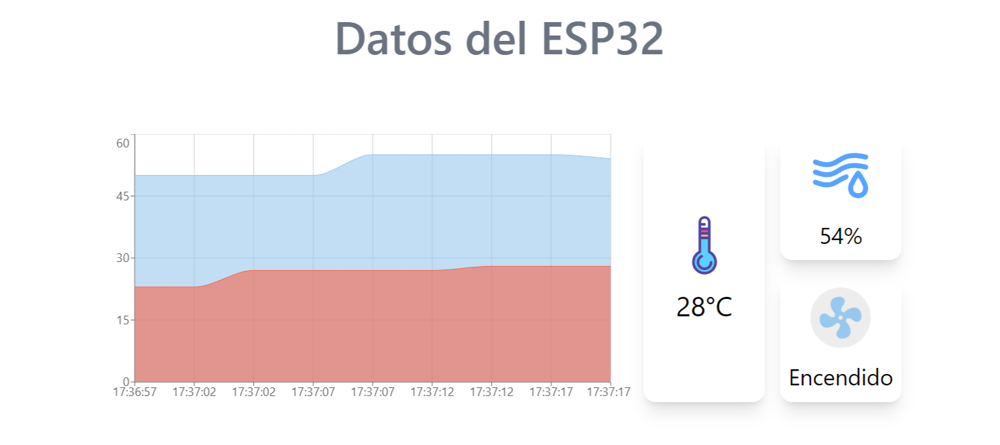

# Arquitectura de Computadoras con ESP32

Este repositorio alberga los proyectos correspondientes al parcial y final del curso de Arquitectura de Computadoras utilizando ESP32.



> **Requerimientos:**
> - [Dlib para Windows con Python 3.x](https://github.com/z-mahmud22/Dlib_Windows_Python3.x)


## API para Envío de Datos

Para enviar datos, utiliza el siguiente endpoint de la API:

- **Endpoint:** `http://127.0.0.1:4000/datos` (Método: POST)
  
  ```json
  {
      "temperatura": 28,
      "humedad": 55,
      "ventiladorEncendido": true
  }
  ```


## API para Recepción de Datos

Para recibir datos, utiliza el siguiente endpoint de la API:

- **Endpoint:** `http://127.0.0.1:4000/api/datos` (Método: GET)


## API para Envío de Imágenes

Para enviar imágenes, utiliza el siguiente endpoint de la API:

- **Endpoint:** `http://127.0.0.1:5000/upload`
  
  **Body:** `form-data`
  
  - **Key:** `file`
  - **Value:** `imagen.jpg`
